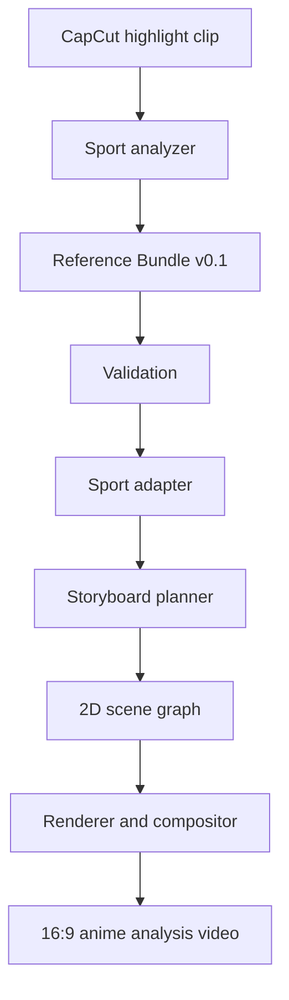

# Architecture V0.1

## System boundary

VideoToAnimeAnalyse consumes a normalized reference bundle. Tracking and sport recognition may be performed by FootballAnalysisAI or another analyzer, but the anime project owns validation, direction, storyboard, scene construction and rendering.

## Layers

| Layer | Responsibility | V0.1 |
|---|---|---|
| Ingest | Probe clip metadata and read reference JSON | Implemented |
| Contract | Validate clip, entities, tracks, events and style profile | Implemented |
| Sport adapter | Convert sport events into dramatic shot recipes | Football implemented |
| Planner | Allocate frames, subjects, camera, motion and effects | Implemented |
| Preview | Inspect the plan before expensive rendering | HTML implemented |
| Scene graph | Resolve reusable backgrounds, rigs and layers | Planned |
| Renderer | Produce limited-animation frames | Planned |
| Compositor | Effects, telestration, audio and final FFmpeg output | Planned |

## Dependency rule

Dependencies point inward toward the contract and shared planner. A sport adapter may depend on shared models, but shared models must never import a sport adapter.

## Deterministic core

The same reference JSON and profile must produce the same storyboard. Generative AI may later create optional assets, but it must not silently change event timing, athlete count or outcome.

## Treatment levels

Storyboard shots carry treatment levels 1–3. Renderers use this value to select cost and quality:

- Level 1: held drawing, camera move, overlay.
- Level 2: reusable loop or interpolated rig.
- Level 3: bespoke hero animation and effects.

